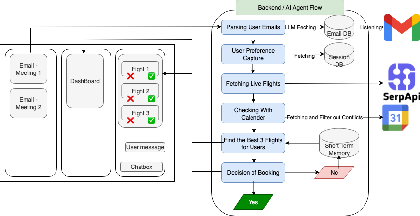

# AISO Hackathon – FlyGiraffe


## Overview
This project powers a flight-planning copilot that reads meeting signals, understands user preferences, and returns bookable flight options. The stack combines a LangGraph-based agent, Google Workspace integrations (Gmail + Calendar), SerpAPI flight search, a FastAPI backend, and a Next.js dashboard.



## Repository Layout
- `agent.py` – LangGraph workflow that orchestrates email parsing, preference capture, SerpAPI flight search, Google Calendar conflict checks (`filter_calender.py`), LLM ranking, booking decisions, and short-term memory via `InMemorySaver`/`InMemoryStore`.
- `server.py` – FastAPI service that fronts the agent with REST endpoints for events, preferences, flight searches, reasoning logs, and booking mocks; also exposes simple auth handlers and mock data fallbacks.
- `filter_calender.py` – Pulls events from Google Calendar and filters flight options to avoid date conflicts; reused inside the agent graph.
- `message.py` / `fetch_flight_data.py` – SerpAPI connectors that download Google Flights results and normalize them into “essential” attributes for downstream filtering.
- `db.py` + `databases/flight_assistant.sql` – PostgreSQL helpers and schema for users, emails, sessions, and stored flight selections.
- `gmail.py`, `gmail_main.py`, `get_gmail_token.py` – Utility scripts for Gmail OAuth token generation and mailbox watch setup.
- `aiso_frontend/` – Next.js app with dashboard UI (`app/dashboard/page.tsx`), component library, and mock/real API client wiring (`lib/api.ts`).
- `requirements.txt`, `parsed_flights.json`, `top_3_flights.json`, `test_message.py` – Python dependencies, cached flight data, and quick verification scripts.

## Backend & Agent Flow
1. **Email parsing** – `parse_user_emails_node` pulls stored emails (via `db.py`) and uses an OpenAI model to extract structured invitations which are written back to Postgres.
2. **Preference capture** – `get_user_preferences` prompts the operator for travel constraints that feed the rest of the graph.
3. **Flight sourcing** – `fetch_flight_data_wrapper` merges preferences with defaults and calls `message.fetch_flight_data_from_serpapi` to obtain candidate itineraries, applying budget, route, and date filters.
4. **Calendar filtering** – `filter_flights_by_calender_node` invokes `get_recent_events` and `filter_flights` from `filter_calender.py` to drop options that overlap existing commitments.
5. **LLM ranking** – `compute_best_flight` asks the OpenAI model to justify the top three options; failures fall back to price sorting.
6. **Short-term memory** – `InMemorySaver` and `InMemoryStore` retain node outputs across the conversation so flight candidates, parsed invitations, and calendar context persist between steps.

7. **Decision loop** – `display_flights` and `booking_or_repeat` present recommendations, collect feedback, and either confirm a booking or loop for refined input.

The FastAPI service exposes these capabilities through `/api/flights/search`, `/api/agent/search_flights`, `/api/agent/reasoning/{meeting_id}`, and meeting-essential routes used by the frontend. When agent features are unavailable, it serves mock data from cached JSON.

## Frontend (Next.js)
- The dashboard (`app/dashboard/page.tsx`) lays out meetings, essential info, reasoning history, and flight search panels.
- Components in `aiso_frontend/components/` talk to the backend via `lib/api.ts`, which can target local Next.js API routes or the FastAPI server depending on `NEXT_PUBLIC_USE_MOCK`.
- Mock API routes (e.g., `app/api/flights/search/route.ts`) mirror backend responses so the UI works without the Python services.

## External Integrations & Environment
- **OpenAI** – `OPENAI_API_KEY` for LangGraph LLM calls.
- **SerpAPI** – `SERPAPI_API_KEY` (or `SERPAPI_KEY`) for Google Flights data.
- **Google Calendar & Gmail** – OAuth credentials (`credentials.json`, `token.json`, `GOOGLE_APPLICATION_CREDENTIALS`) required by `filter_calender.py` and Gmail scripts.
- **PostgreSQL** – `DB_HOST`, `DB_USER`, `DB_PASSWORD`, `DB_NAME`, `DB_PORT` consumed by `db.py`.
- Store these values in the project `.env`; Python modules rely on `python-dotenv` to load them automatically.

## Running Locally
1. **Python environment**
   ```bash
   python3 -m venv .venv
   source .venv/bin/activate
   pip install -r requirements.txt
   ```
2. **Backend server**
   ```bash
   uvicorn server:app --reload --host 0.0.0.0 --port 8000
   ```
   FastAPI serves REST endpoints at `http://localhost:8000`.
3. **Frontend**
   ```bash
   cd aiso_frontend
   npm install
   npm run dev
   ```
   The dashboard runs on `http://localhost:3000`.

## Useful Scripts & Utilities
- `get_gmail_token.py` – Launches OAuth flow and saves `token.json`.
- `gmail.py` / `gmail_main.py` – Quick scripts to fetch invitation emails or set up a Gmail watch.
- `filter_calender.py` – Standalone runner that prints December 2025 calendar events and reports which flights avoid conflicts.
- `test_message.py` – Smoke test for SerpAPI integration; writes parsed results to `test_parsed_flights.json`.
- `init_db.py` (if extended) and `databases/flight_assistant.sql` – Initialize or inspect the Postgres schema with sample data.

With the above pieces running, the frontend can confirm meeting essentials, trigger the agent workflow through FastAPI, display LLM reasoning, and present filtered flight options ready for booking. Update the `.env` and cached JSON files as needed when integrating with live services or alternate date ranges.